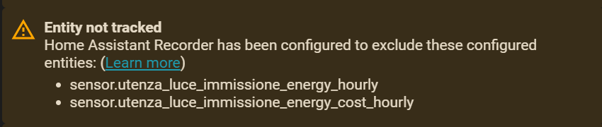

# Energy Dashboard

[← Back to README](../README.md)

The Energy Dashboard is a special statistics consumer: it renders **hourly bars** computed from the hour-by-hour deltas of a statistic's cumulative `sum`. That means any statistic feeding it must have **one data point per hour** — no less (empty bars), and ideally no more (everything beyond one point per hour is storage the dashboard never reads).

A Lean meter with `cycle: hourly` produces exactly that: one consolidated LTS row per hour, upserted live (every ≤5 minutes) so the current hour keeps growing on the dashboard in near real time, then finalized at the hour rollover.

## The recipe

```yaml
lean_utility_meter:
  # Feeds the Energy Dashboard: 1 LTS row per hour, nothing else
  my_energy_hourly:
    unique_id: my_energy_hourly
    source: sensor.my_energy_lifetime
    cycle: hourly

recorder:
  exclude:
    entities:
      - sensor.my_energy_hourly   # LTS written by Lean directly, recorder not needed
```

Then select `sensor.my_energy_hourly` as the source in **Settings → Dashboards → Energy**. The same pattern works for cost/compensation statistics (a Lean hourly meter on a monetary lifetime sensor).

Tip: point the hourly meter at a **lifetime** meter (a no-cycle `utility_meter` or equivalent) rather than at the raw device sensor, for two reasons:

- **It absorbs counter resets.** Firmware updates and device glitches can reset or bounce the hardware counter; fed directly to a statistics consumer, the recovery gets double-counted by reset detection and shows up as phantom energy in the dashboard.
- **It abstracts away the physical device.** If the sensor ever fails and gets replaced, the new device brings a new entity_id, possibly a different integration (say, Wi-Fi → Zigbee) — and its counter starts again from zero. The lifetime meter holds a *local, device-independent* running total: swapping the hardware only means re-pointing its `source`, while the accumulated value, the meters chained to it and all their statistics carry on unaffected.

## The point budget

Counting what actually lands in the database per meter:

| Setup | Long-term rows / year | Short-term rows / year | Raw states |
| --- | --- | --- | --- |
| Lean `cycle: hourly` | **8,760** (24 × 365) | 0 | 0 |
| Lean `cycle: daily` | 365 | 0 | 0 |
| Lean `cycle: monthly` | 12 | 0 | 0 |
| Recorder-tracked sensor | 8,760 | ~105,000 (5-min, purged after ~10 days but constantly churning) | every state change (purged after `purge_keep_days`) |

The hourly cycle is the most expensive Lean cycle by far — but 8,760 rows/year is the **exact minimum** the Energy Dashboard can work with, and it is the same long-term footprint the recorder would produce anyway. What you save is everything else: no raw state history, no 5-minute short-term statistics, no purge churn. Use `cycle: hourly` only for meters that actually feed the Energy Dashboard; everything else (cards, monthly reports, yearly totals) is happier with the coarser cycles.

## Why `sensor.` statistics and not `lean_utility_meter:` external ids

Home Assistant offers integrations a second way to publish statistics: **external statistic ids** in the form `lean_utility_meter:my_energy_hourly`. The Energy Dashboard validator treats those as first-class citizens (no entity checks at all), so it may look like the cleaner route. It was deliberately **not** chosen.

External statistic ids are only usable where a *statistic* can be selected: the Energy Dashboard and the statistics-specific cards. They are **not entities**, so they are invisible to everything that selects an *entity*: standard history cards, `statistics-graph` by entity, template sensors, automations, and the whole ecosystem of custom cards (apexcharts-card and friends). Keeping the statistics under the meter's own `sensor.` entity_id means every dashboard — standard and custom — keeps working, and the meter's live state and its long-term history stay attached to one single id.

## The "Entity not tracked" warning

The trade-off of that choice: the Energy Dashboard validator assumes that statistics for an *entity* id are produced by the recorder, so for a recorder-excluded Lean meter it reports:



This warning is **cosmetic and expected**. The statistics exist (Lean writes them directly), the dashboard reads and renders them correctly. Do not "fix" it by re-adding the meter to the recorder: that would put two writers (recorder + Lean) on the same statistic series and corrupt the sums — the [`recorder_exclusion` repair](repairs.md) exists precisely to catch that.

## Bringing history along

If the dashboard was previously fed by a recorder-tracked sensor, its hourly history can be copied into the new Lean hourly meter 1:1 with the [`import_history` service](services.md) — with `cycle: hourly` the consolidation step keeps one row per hour, i.e. the source's hourly rows are imported unchanged, cumulative sums included. See [Migration Workflows](migration.md) for the full procedure.
