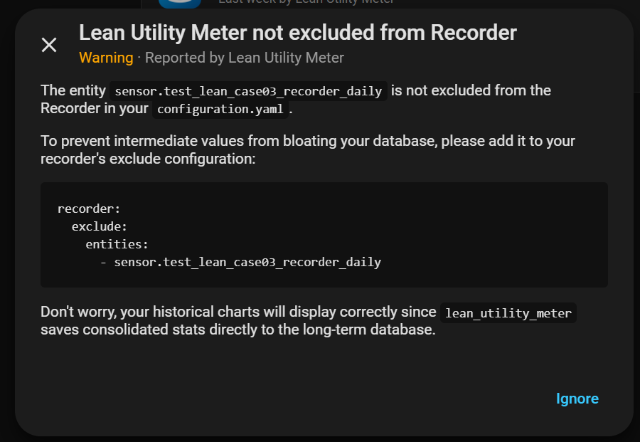
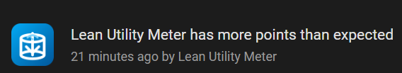
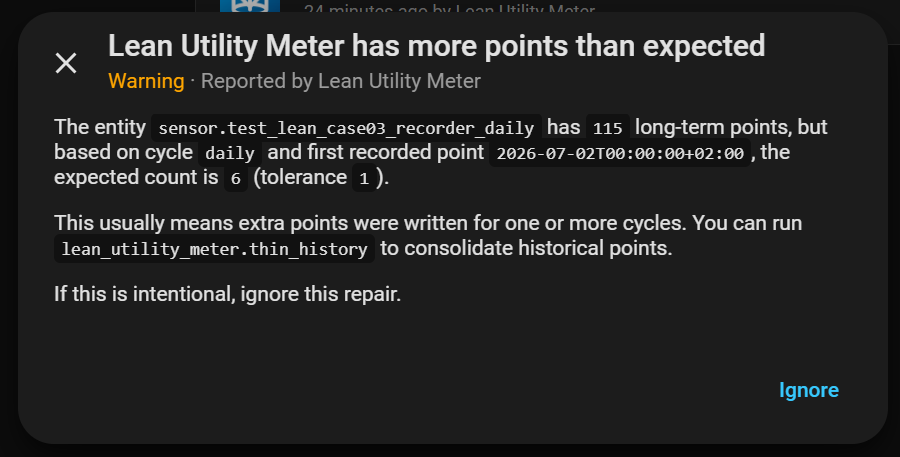

# Repairs Reported to User

[← Back to README](../README.md)

The integration monitors its own health and raises Home Assistant **Repairs** when it detects a situation that deserves your attention. There are currently two of them, and both are advisory: they never block the meter from working, they just tell you that something is not in the recommended state.

## `recorder_not_excluded`

**Trigger** — the Lean entity is currently *included* by recorder filters.

Lean writes its consolidated history directly into LTS, so recorder state tracking adds nothing: it only bloats the short-term `states` table with high-frequency rows that will never be used (see [Why Recorder Should Be Excluded](how-it-works.md#why-recorder-should-be-excluded)). This Repair typically shows up when the recorder include/exclude rules were never aligned with the Lean recommendation — for example right after creating a new meter — or in test setups where inclusion is forced on purpose.

**What to do** — in production, add the entity to the recorder `exclude` list and the Repair goes away. If the inclusion is an intentional test case, you can simply ignore it.

## `unexpected_points_for_cycle`

**Trigger** — the entity is correctly excluded from recorder, but its LTS series contains *more* long-term points than the configured cycle should have produced (beyond a tolerance of 1 extra point).

The expected count is computed from the data itself: starting from the timestamp of the first long-term point of the entity, the integration counts how many cycle boundaries have elapsed up to and including the current cycle, then compares that number with the actual row count. An overage means extra points were written for one or more cycles — typical causes are restart timing anomalies around rollover, noisy legacy history inherited from a classic utility meter, or older data that was never consolidated.

**What to do** — run `lean_utility_meter.thin_history` on the affected entity to bring the series back to one point per cycle. If the extra points are intentional in your workflow, ignore the Repair.

Two behaviors worth knowing: the Repair clears itself automatically as soon as the count returns within the expected range, and it is deliberately suppressed while recorder includes the entity — in that configuration an overage is expected, and the `recorder_not_excluded` Repair is already covering the root cause.
